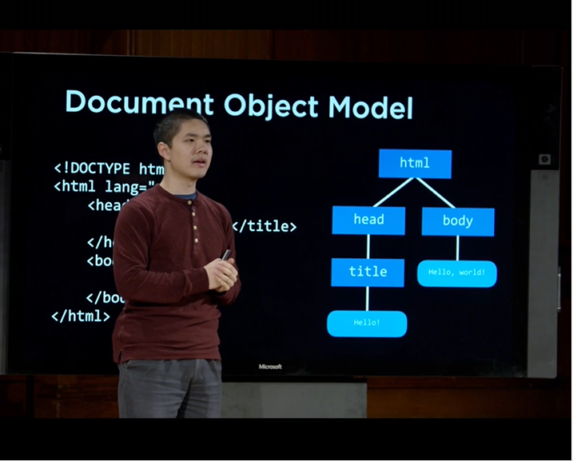
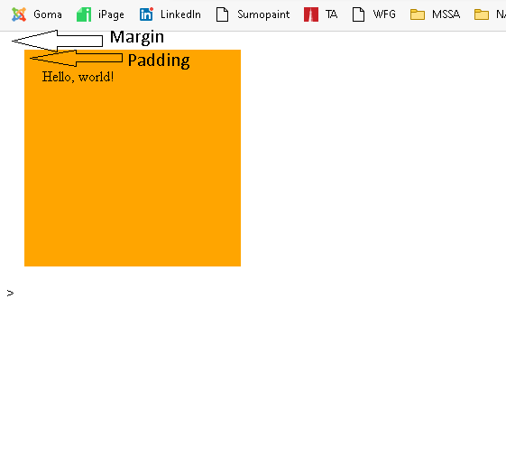
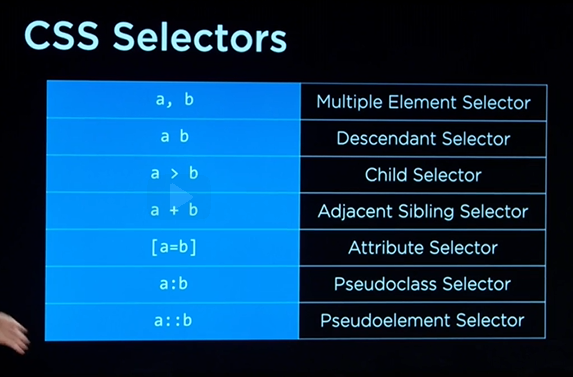

# Lecture 1

## HTML and CSS 
- HTML
- CSS
- Bootstrap
- SASS

## Git
- GitHub
- GitHub Desktop

- C:\Users\goric\OneDrive\Documents\Education\edX\HarvardX CS50W/Hello.txt 
    - Using VS Code 
- Installed  

## Auto Close Tag 
-  Jun Han 
    - From <https://marketplace.visualstudio.com/items?itemName=formulahendry.auto-close-tag>  
- DOM 
    - Document Object Model 
    -  


- HREF = Hyperlink Reference
- Tr= Table Row 
- Td= Table Data 
- HTML 5 
- CSS3 
    - Rel= relationship 
    - Multiple element selector = tr, th { } 
    - Comment =   /*  comment here  */ 
- `<div>` 
    - Division 
    - Section of a page 
- Style 
    - Paddding is inside the element 
    - Margin is on the outside of the element 
    - 
- Foo = is a generic name. 
- Id = uses (#) #foo 
- Class = uses (.) .bar 
- Specificity 
    - Inline 
    - Id 
    - Class 
    - Type 
    -  

- Responsive Design 
    - Viewport 
    - `<meta name="viewport" content="width=device-width, initial-scale=1.0">`  
    - Media Queries 
    - Flexbox 
    - Grids 

- Bookmark 200811 
    - Nothing here. Just taking a screenshot ofthe time.
- Responsive 
    - Flexbox 
    - Bootstrap 
        - Getbootstrap.com 
        - CSS Library 
            - Documentation 
            - Components 
        - Bootstrap divides every row  into a  12  column units 
        - | 1 | 2 | 3 | 4 | 5 | 6 | 7 | 8 | 9 | 10 | 11 | 12 |   
          | - | - | - | - | - | - | - | - | - | -- | -- | -- |
          | 1 | 2 | 3 | 4 | 5 | 6 | 7 | 8 | 9 | 10 | 11 | 12 |
- SASS is an extension of CSS. It has an extension of .scss. 
    - But browsers don't know SASS. 
    - You need to compile it from SASS - CSS. 
    - [How to Install SASS on Windows](https://www.youtube.com/watch?v=Do7ivdaQU8Y) 
    - SASS live compiler 
        - Watch.sass 
        - Save 
        - ```scss
            $message
            
            div {
                font-color: red;
            }
            ```
            Defines all [languages](https://github.com/github/linguist/blob/master/lib/linguist/languages.yml) known to GitHub. See instructions [here](https://docs.github.com/en/github/writing-on-github/creating-and-highlighting-code-blocks).
        - Step by Step
            * Go to GitHub and copy clone link
            * Open link on GitHub Desktop
                - Open in Visual Studio Code
            * All files will show in VS Code.
                - Make changes in VS Code.    
            * Save your work in VS Code
            * Go back to GitHub Desktop and submit Commit.
            * From there, you can Fetch origin:
                - Push changes
                - Pull changes from GitHub if you made any changes on the web.
